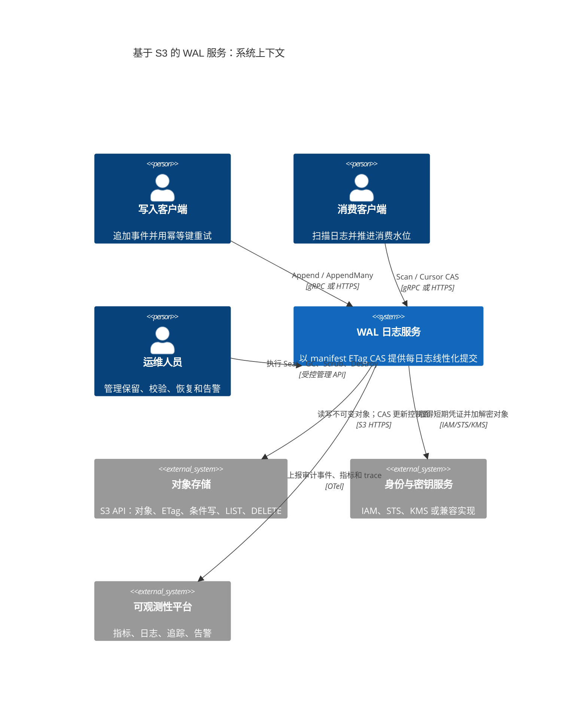
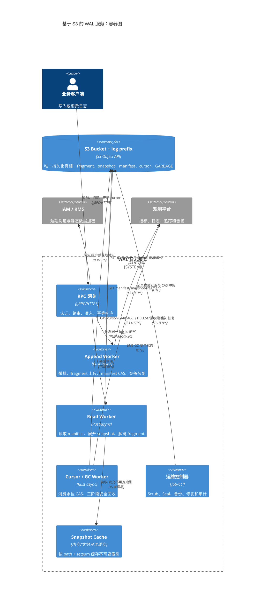
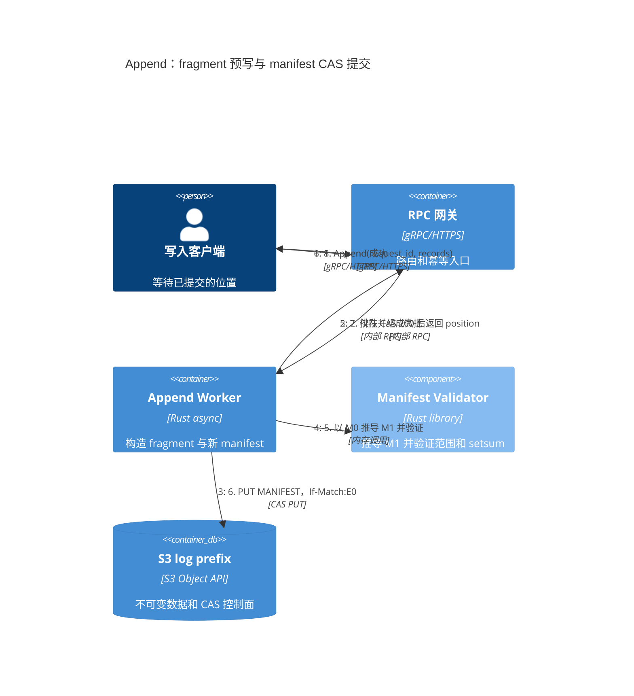
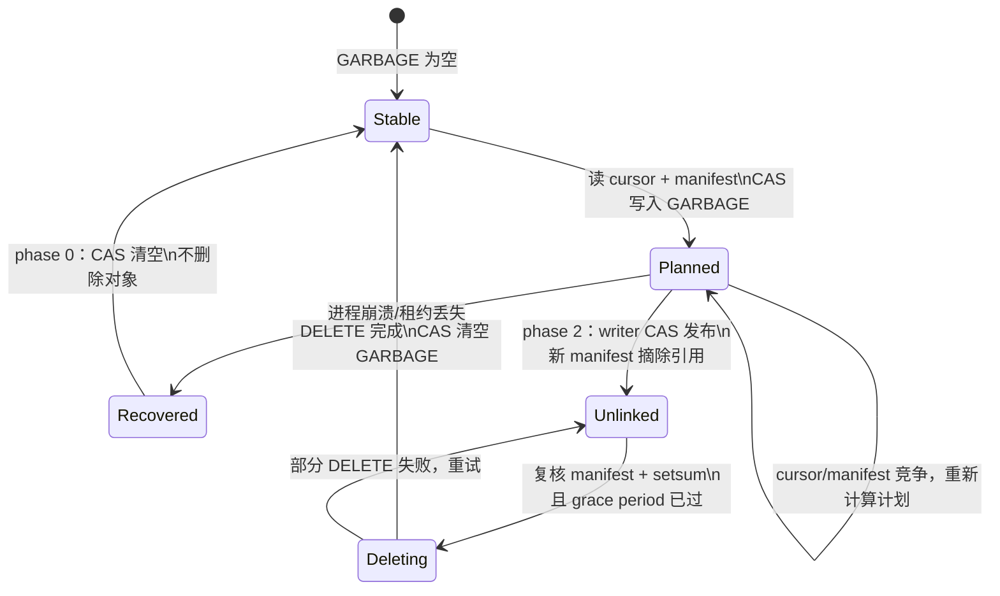

# 基于 S3 协议的 WAL 日志服务：以 Chroma WAL3 为参考的技术架构

**研究日期：** 2026-09-02
**基准实现：** Chroma `wal3`，[`3090b912eed5f396e30d30e5159ce59d60523b64`](https://github.com/chroma-core/chroma/tree/3090b912eed5f396e30d30e5159ce59d60523b64/rust/wal3)（本文所有「WAL3 已实现」结论均固定到此提交）
**范围：** 以 S3/兼容 S3 的对象存储构建一个按 log-prefix 隔离、单活跃写者优先、可恢复多写者竞争、可横向扩展读取的 WAL 服务；不是文件系统，也不是 Kafka/Pulsar 的替代方案。

## 结论先行

WAL3 的关键不是「在 S3 放日志文件」，而是把对象存储的两类语义组合为一个提交协议：

1. **不可变数据面**：批量 append 编码为唯一命名的 Parquet fragment，并以 `If-None-Match`（创建而非覆盖）上传；成功上传但尚未被索引的 fragment 是可回收 orphan，不能视为已提交。
2. **可变控制面**：唯一的根对象 `manifest/MANIFEST` 保存日志的已提交视图。读取得到其 ETag，更新以 `If-Match: ETag` CAS；CAS 成功才是该 fragment 对外可见且 append 成功的线性化点。
3. **可验证索引**：manifest 持有 fragment 与不可变 snapshot 的树，记录连续的 `LogPosition` 区间、累计字节数和可加减的 `setsum`；后者让全量 scrub 能发现丢片段、错引用或静态数据损坏。
4. **删除不是事务**：游标 pin 住消费下界；GC 先把待删清单 CAS 写到 `gc/GARBAGE`，再让写者从 manifest 摘除引用，等待保护窗口后才删除对象。绝不反过来先删数据。

这是利用 S3 条件写实现乐观并发控制（OCC）的日志服务，而非依赖 S3 跨对象事务。WAL3 README 明确将其定义为完全建立在对象存储之上的 linearizable log，并将协调前提收敛为对象存储的 `If-Match` 原子性。[设计总览](https://github.com/chroma-core/chroma/blob/3090b912eed5f396e30d30e5159ce59d60523b64/rust/wal3/README.md#L1-L16) AWS 文档也确认：带正确 ETag 的 `If-Match` 写才成功，不匹配返回 `412`；`If-None-Match` 的并发创建中仅最先完成者成功。[AWS 条件写语义](https://docs.aws.amazon.com/AmazonS3/latest/userguide/conditional-writes.html)

## 1. 问题、边界与必须满足的存储契约

### 1.1 服务语义

每个 `log_id` 映射到一个固定 bucket + 独立 prefix。对同一日志，服务提供：

- `Append` / `AppendMany`：返回唯一 `LogPosition { offset }`；`offset` 是无空洞、严格递增的记录序号。当前源码的注释仍提到 timestamp，但实际 struct 只有私有 `offset` 字段；Parquet payload 另有 `timestamp_us` 列，不能把两者混为 API position。该类型定义见 [lib.rs](https://github.com/chroma-core/chroma/blob/3090b912eed5f396e30d30e5159ce59d60523b64/rust/wal3/src/lib.rs#L362-L448)，Parquet 列构造见 [writer.rs](https://github.com/chroma-core/chroma/blob/3090b912eed5f396e30d30e5159ce59d60523b64/rust/wal3/src/writer.rs#L1167-L1219)。
- `Scan(from, limits)`：从半开区间起点读取 fragment 元数据，再按需下载/解析数据；`limits` 同时约束记录数、字节数、offset 或时间。[reader.rs](https://github.com/chroma-core/chroma/blob/3090b912eed5f396e30d30e5159ce59d60523b64/rust/wal3/src/reader.rs#L25-L149)
- `Cursor`：由消费者 CAS 前移的持久消费水位；最小 cursor 决定可删除的最老数据。
- `GC`、`Scrub`、`Seal`、`Destroy`：均是显式管理操作，不能混入 append 热路径。

线性化的严格定义应为：一次 append 仅在其 fragment 已成功以不可变方式落盘、且包含它的新 manifest CAS 成功后才向调用者成功返回；在该点之后任一读取最新 manifest 的读者均可找到它。fragment 上传本身不构成提交。WAL3 的 `append_batch_internal` 正是先 `upload_parquet`，后 `publish_fragment`，最后完成等待者。[写入顺序](https://github.com/chroma-core/chroma/blob/3090b912eed5f396e30d30e5159ce59d60523b64/rust/wal3/src/writer.rs#L742-L773)

### 1.2 S3（或兼容实现）必须具备的能力

| 能力 | 使用对象 | 必要原因 | 失败时的处理 |
|---|---|---|---|
| `GET/HEAD` 返回稳定 ETag | manifest、cursor、GARBAGE | 形成下一次 CAS 的 witness | 缺 ETag 视为存储不兼容/数据损坏；WAL3 对 manifest/cursor 都显式报错。|
| `PUT If-None-Match: *` | 初始 manifest、fragment、snapshot、首次 cursor | 防止唯一对象被静默覆盖 | `412`/AlreadyExists 是竞争，重新加载状态或换新 fragment id。|
| `PUT If-Match: <etag>` | manifest、已有 cursor、GARBAGE | 唯一控制面原子状态迁移 | `412` 是 contention，丢弃本地推测状态，重新读 manifest 后恢复。|
| 强 read-after-write/按对象版本可见 | manifest 及其新引用的对象 | manifest 发布后读者必须能读到它引用的 fragment/snapshot | 若后端不保证，需在服务层读后确认并把确认延迟计入 SLA。|
| `LIST prefix`、`DELETE` | orphan 扫描、GC、destroy | 发现候选垃圾并删除已确认无引用对象 | LIST 只能作候选来源，不能据此判断「未引用即可删」。|
| 限流、超时、可分类错误 | 全部请求 | S3 可能节流、瞬断、权限失败 | 可重试错误指数退避；权限/序列化/不变量错误立即失败。|

AWS 的 `If-Match` 可用于 `PutObject`/`CompleteMultipartUpload`/`CopyObject`，且需要 `s3:GetObject` 与 `s3:PutObject`；`If-None-Match` 对同一 key 的竞争只允许首个完成者成功。[AWS API 约束](https://docs.aws.amazon.com/AmazonS3/latest/userguide/conditional-writes.html#conditional-write-behavior) 因而「S3-compatible」不能只验证基本 PUT/GET，必须通过上述并发 CAS 契约测试。普通对象由 bucket 内 key 标识，开启版本控制时还会有 version ID；日志协议仍应把 ETag/witness 当作控制面版本令牌，而不是把对象名当锁。[S3 对象模型](https://docs.aws.amazon.com/AmazonS3/latest/userguide/Welcome.html#Objects)

**非目标和不可假设项：** S3 没有跨 `fragment + manifest + cursor + delete` 的原子提交；LIST 不是锁；删除不应成为提交协议的一部分；多个写者不能依赖本地互斥锁得到分布式安全。建议仍以 leader election 将正常流量引至单写者，CAS 仅用于故障接管/脑裂防御。WAL3 也说明它主要为单写者高吞吐设计，但多写者存在时仍以竞争恢复维持正确性。[并发定位](https://github.com/chroma-core/chroma/blob/3090b912eed5f396e30d30e5159ce59d60523b64/rust/wal3/README.md#L1-L16)

### 图 1：系统上下文（推荐的服务化部署）



图中 `WAL 日志服务` 是本文建议增加的服务外壳；WAL3 本身提供对象存储上的日志协议核心。S3 是唯一持久化系统，不能再隐式引入一个数据库作为第二份提交真相。

## 2. 分层架构

```text
客户端 / RPC 网关
  ├─ Append 服务：准入、批处理、背压、幂等键（服务产品层，建议补充）
  ├─ Read 服务：Scan、fragment 下载/Parquet 解码、snapshot cache
  ├─ Cursor 服务：消费者 offset 的 CAS 持久化
  └─ 运维服务：Bootstrap、GC、Scrub、Seal、复制、Destroy
                      │
          WAL 协议核心（每个 log 一个状态机）
  ├─ FragmentBatchManager       ├─ ManifestManager
  ├─ immutable fragment uploader ├─ snapshot builder
  └─ retry/backoff + epoch/recovery + invariant validation
                      │
               Storage Adapter（S3 SDK）
  GET/HEAD/PUT{IfMatch,IfNoneMatch}/LIST/DELETE + timeout/metrics/KMS
                      │
    bucket / tenant-prefix / log-prefix 的 S3 或兼容对象存储
```

WAL3 将 reader 和 writer 分离，读不会阻塞写；数据 fragment 是不可变，根 manifest 可变，snapshot 是不可变的索引内部节点。[架构与接口](https://github.com/chroma-core/chroma/blob/3090b912eed5f396e30d30e5159ce59d60523b64/rust/wal3/README.md#L18-L72) 实现上应将「协议核心」与 S3 SDK 隔离为 `ObjectStore` trait，令本地/内存 fake 可运行同一套恢复和性质测试；WAL3 的 `FragmentManager`、`ManifestManager` 工厂接口正是这个替换缝。[接口边界](https://github.com/chroma-core/chroma/blob/3090b912eed5f396e30d30e5159ce59d60523b64/rust/wal3/src/interfaces/mod.rs#L464-L613)

### 图 2：容器与控制面/数据面边界



### 2.1 控制面和数据面的故障域

- **数据面（大量、只增）**：Parquet fragment；对象名含不可重用 identifier，PUT 必须 `IfNotExist`。任何失败重试都不可覆盖既有对象。
- **控制面（小、CAS、热点）**：一个 manifest；cursor 是多个独立小对象；GC 意图为一个 `GARBAGE` 对象。控制面的写入优先级要高于大数据上传，WAL3 也对两类节流参数分别配置。[选项定义](https://github.com/chroma-core/chroma/blob/3090b912eed5f396e30d30e5159ce59d60523b64/rust/wal3/src/lib.rs#L449-L631)
- **索引面（只增、可缓存）**：content-addressed snapshot；它把 manifest 的历史前缀折叠为树，避免每次重写整个历史索引。

这一区分是可用性的核心：读者只需稳定 manifest 快照即可无锁读取历史；写者失败最多留下未链接对象；控制面 CAS 冲突不会产生双提交。

## 3. 对象布局与数据模型

以下是当前源码路径函数所定义的布局，而不是 README 早期示例的概念图：

```text
s3://<bucket>/<tenant>/<log-id>/
├── manifest/MANIFEST                       # JSON；唯一可变 root，ETag = CAS witness
├── log/
│   ├── Bucket=<16位hex>/FragmentSeqNo=<16位hex>.parquet  # 兼容旧 seq-no 格式
│   └── Uuid=<uuid-v7>.parquet                         # 支持的 UUID 标识格式
├── snapshot/SNAPSHOT.<setsum-hex>          # JSON；内容寻址、不可变
├── cursor/<validated-name>.json             # JSON；每个消费者独立 CAS
└── gc/GARBAGE                               # JSON；空=无 GC，非空=待处理协议状态
```

fragment 的两种命名、seq-no 旧格式的 bucket 前缀、UUID 格式不再分桶，均以源码为准。[路径生成与解析](https://github.com/chroma-core/chroma/blob/3090b912eed5f396e30d30e5159ce59d60523b64/rust/wal3/src/lib.rs#L916-L1016) `manifest/MANIFEST`、`snapshot/SNAPSHOT.<setsum>` 路径定义在 [manifest.rs](https://github.com/chroma-core/chroma/blob/3090b912eed5f396e30d30e5159ce59d60523b64/rust/wal3/src/manifest.rs#L15-L41)，GC 固定使用 `gc/GARBAGE`。[gc.rs](https://github.com/chroma-core/chroma/blob/3090b912eed5f396e30d30e5159ce59d60523b64/rust/wal3/src/gc.rs#L22-L31)

### 3.1 Fragment（数据文件）

`Fragment` 元数据至少含 `path`、`seq_no`/UUID、`start`、`limit`、`num_bytes`、`setsum`；它代表一段相邻 append，区间为 `[start, limit)`。[字段定义](https://github.com/chroma-core/chroma/blob/3090b912eed5f396e30d30e5159ce59d60523b64/rust/wal3/src/lib.rs#L916-L940) WAL3 用 `construct_parquet` 将一批消息连同位置写成 Parquet，而 uploader 以 `IfNotExist` 上传；已存在/前置条件失败被转译为日志竞争，其他暂时错误在 20 秒内退避重试、权限错误立即透传。[Parquet 上传实现](https://github.com/chroma-core/chroma/blob/3090b912eed5f396e30d30e5159ce59d60523b64/rust/wal3/src/interfaces/batch_manager.rs#L479-L555)

服务落地时，fragment 需包含：格式版本、记录批次的首位置、逐记录 payload、可选 schema/codec/key-id、统计信息和 fragment 校验值；所有字段必须由 manifest 中的边界与 setsum 闭环验证。不要让客户端用路径猜 offset，路径是存储定位符，manifest 才是提交顺序的唯一权威。

### 3.2 Manifest（提交记录）

当前 `Manifest` JSON 字段是：`setsum`、`collected`（已经从可读树摘除的数据校验和）、`acc_bytes`、`writer`、`snapshots[]`、`fragments[]`，以及可选 `initial_offset`、`initial_seq_no`。[结构与初始化](https://github.com/chroma-core/chroma/blob/3090b912eed5f396e30d30e5159ce59d60523b64/rust/wal3/src/manifest.rs#L248-L291) 每一次提交构造完整的新 JSON，并且只用当前 GET 得到的 ETag 作 `IfMatch`；首次初始化用 `IfNotExist`。这是 WAL 的唯一 compare-and-swap 点。[初始化/CAS 安装](https://github.com/chroma-core/chroma/blob/3090b912eed5f396e30d30e5159ce59d60523b64/rust/wal3/src/interfaces/s3/manifest_manager.rs#L397-L479)

必须在 decode 和每次状态转换后验证下列不变量：

1. `fragments` 的标识符类型一致（全 SeqNo 或全 UUID）；不可混用。
2. 每个 fragment `start < limit`，按位置严格递增、区间互不重叠且覆盖 append 顺序；next offset 从最新 `limit` 推导。
3. 每个 snapshot 的 `[start, limit)` 同样有序、互不重叠，孩子完整落在父区间；snapshot 不能同时直接含 fragment 与子 snapshot。
4. `manifest.setsum = collected + 所有当前 snapshot.setsum + 所有当前 fragment.setsum`；每个 snapshot 的路径中 setsum 必须等于其内容重新计算的 setsum。
5. manifest 所引用的每一个对象必须存在且格式/范围/校验和匹配；一次 manifest CAS 不可删除旧引用，也不可让新引用悬空。

前四项来自 README 的 manifest 不变量与源码 `scrub` 对 snapshot、路径 hash、统一 identifier 的实际检查。[README 不变量](https://github.com/chroma-core/chroma/blob/3090b912eed5f396e30d30e5159ce59d60523b64/rust/wal3/README.md#L86-L129) [snapshot scrub](https://github.com/chroma-core/chroma/blob/3090b912eed5f396e30d30e5159ce59d60523b64/rust/wal3/src/manifest.rs#L100-L247)

### 3.3 Snapshot（索引压缩树）

snapshot 是 immutable JSON，含自身 `path/depth/setsum/writer` 和「只含 children snapshots 或只含 fragments」的列表；`SnapshotPointer` 在父节点保存 `setsum/path/depth/start/limit/num_bytes`。[数据结构](https://github.com/chroma-core/chroma/blob/3090b912eed5f396e30d30e5159ce59d60523b64/rust/wal3/src/manifest.rs#L70-L247) 当 manifest 内直接 fragment 或下级 snapshot 指针超过阈值时，后台先写 snapshot，下一次 manifest 才替换已稳定的历史前缀；源码还保留最后一个 fragment，避免没有可推导的 next sequence 而卡死。[生成规则](https://github.com/chroma-core/chroma/blob/3090b912eed5f396e30d30e5159ce59d60523b64/rust/wal3/src/manifest.rs#L292-L381)

默认目标并非神秘常数：出站 snapshot 指针阈值约为 `2^18 / 142`，fragment 指针阈值约为 `2^19 / 256`，约束 manifest/snapshot JSON 体积而不是历史记录条数。[默认值](https://github.com/chroma-core/chroma/blob/3090b912eed5f396e30d30e5159ce59d60523b64/rust/wal3/src/lib.rs#L511-L546) 这让 tail read 仅 GET 根 manifest 和最新 fragment，历史 scan 才并行展开树。reader 对重叠范围筛选 snapshot，逐层并发加载，并可插入 snapshot cache。[读取展开](https://github.com/chroma-core/chroma/blob/3090b912eed5f396e30d30e5159ce59d60523b64/rust/wal3/src/reader.rs#L276-L343)

### 3.4 Cursor 与 GARBAGE

cursor JSON 的业务字段是 `position`、`epoch_us`、`writer`；但 API 必须把读到的 ETag 连同 cursor 返回为 witness，更新使用 `IfMatch`，新建使用 `IfNotExist`。每个 cursor 是独立对象，因此紧急 pin 不争抢 manifest，但它与 manifest 不是同一原子事务。[cursor 设计](https://github.com/chroma-core/chroma/blob/3090b912eed5f396e30d30e5159ce59d60523b64/rust/wal3/README.md#L130-L248) [实际 CAS 实现](https://github.com/chroma-core/chroma/blob/3090b912eed5f396e30d30e5159ce59d60523b64/rust/wal3/src/cursors.rs#L124-L216)

`GARBAGE` 记录待删 snapshots、连续/可验证的 fragment 范围、为压缩新建的 snapshots 和相关 setsum；它是恢复日志而不是「删除任务队列」。非空 `GARBAGE` 一次只允许一个 GC 事务在途；完成时 CAS 重置为空而不是删除该对象，避免把 delete 当 compare-and-swap。[GC 数据结构和约束](https://github.com/chroma-core/chroma/blob/3090b912eed5f396e30d30e5159ce59d60523b64/rust/wal3/src/gc.rs#L63-L261)

## 4. 写路径：逐步提交协议

正常写入应按如下状态机实现；任一网络调用都必须有 deadline、trace id、请求级指标和明确的 retry 分类。

1. **路由与准入。** 网关把同一 `log_id` 定向到 leader；用每日志队列做背压。若产品要求客户端重试幂等，另建 `request_id → LogPosition` 的去重状态（WAL3 的 core API 并不自动提供端到端幂等）。可选 admission predicate 只能检查已排队元数据，不可在持锁时做 I/O。[准入限制](https://github.com/chroma-core/chroma/blob/3090b912eed5f396e30d30e5159ce59d60523b64/rust/wal3/src/lib.rs#L547-L615)
2. **微批。** 将请求累计至字节阈值或时间阈值；WAL3 默认 `64,000,000` bytes、`100,000µs`，并按 prefix 配置 fragment/manifest 独立吞吐与预留重试余量。[节流默认值](https://github.com/chroma-core/chroma/blob/3090b912eed5f396e30d30e5159ce59d60523b64/rust/wal3/src/lib.rs#L449-L510)
3. **取得/验证稳定状态。** 加载 manifest+ETag，scrub 结构；计算 batch 首尾 `LogPosition` 与唯一 fragment id。UUID-v7 的创建时间还参与 orphan GC 的保护窗口。
4. **构造并上传 fragment。** 生成 Parquet、片段 setsum 和唯一 key；以 `PUT If-None-Match:*` 上传。该对象成功后是 *prepared*，而非 *committed*。
5. **可选并行 snapshot。** 如果当前索引需要压缩，可异步写内容寻址 snapshot；不可先在 manifest 引用未确认成功的 snapshot。
6. **推导新 manifest。** 基于稳定 manifest 加入 fragment（或替换被 snapshot 覆盖的历史前缀），更新 `setsum/acc_bytes/writer`；再次本地校验所有不变量。
7. **原子发布。** `PUT manifest/MANIFEST If-Match:<old-etag>`。成功返回的新 ETag 即 commit proof，也是 append 的线性化点；此时才唤醒 batch 的所有请求并返回位置。
8. **CAS 冲突恢复。** `412`/precondition 意味另一个写者已经发布：本轮 fragment 不可复用为「下一次编号」，关闭/废弃本 writer epoch，重新 GET manifest、重新计算位置和新 id，再重试。WAL3 让 `OnceLogWriter` 在发现竞争后被丢弃并走与初始化相同的恢复路径。[竞争恢复设计](https://github.com/chroma-core/chroma/blob/3090b912eed5f396e30d30e5159ce59d60523b64/rust/wal3/src/writer.rs#L528-L647)
9. **后台清理。** CAS 失败、客户端超时或进程崩溃留下的 prepared fragment 不影响可见日志；在保护窗口之后由 GC 发现/删除。不得为了「立即整洁」在失败分支同步删除它。

### 图 3：Append 的线性化提交时序



第 4 步成功而第 6 步未成功时，fragment 仍是不可见 orphan；第 6 步返回 `412` 时必须重新从第 3 步读取状态并使用新的写者 epoch/fragment id。也就是说，图中的第 6 步而不是对象上传才是唯一线性化点。

```text
append batch
    │                         (immutable)
    ├─ PUT log/Uuid=<new>.parquet If-None-Match:* ──► prepared
    │                                                       │ crash → orphan（不可见）
    ▼                                                       │
GET MANIFEST → (M0, E0) ── build M1 incl. fragment ────────┤
    │                                                       ▼
    └─ PUT MANIFEST If-Match:E0 ── 200/new E1 ──► committed / visible
                                  └─ 412 ──► reload + new epoch (M1 无效)
```

WAL3 的 epoch writer 将竞争作为创建新 writer 的信号；写者在出现无法处理的错误时 shutdown，避免继续以过期状态发布。[writer 外层恢复](https://github.com/chroma-core/chroma/blob/3090b912eed5f396e30d30e5159ce59d60523b64/rust/wal3/src/writer.rs#L30-L126) 对服务而言应把 `LogContentionRetry` 映射为内部重试而非直接把 412 泄漏给客户；超过 deadline 则返回可重试错误及幂等 request id。

## 5. 读路径、一致性与缓存

1. GET manifest 并保存 `(JSON, ETag)`；需要确认读取未陈旧时以 ETag `HEAD/confirm_same` 验证，WAL3 的 `verify` 就是这个目的。[reader API](https://github.com/chroma-core/chroma/blob/3090b912eed5f396e30d30e5159ce59d60523b64/rust/wal3/src/reader.rs#L174-L275) [S3 manifest witness](https://github.com/chroma-core/chroma/blob/3090b912eed5f396e30d30e5159ce59d60523b64/rust/wal3/src/interfaces/s3/manifest_reader.rs#L45-L85)
2. 先在 manifest 直接 fragments 中按 `[start, limit)` 过滤；若请求穿过已压缩历史，按范围并行解析必要 snapshot，递归收集 fragments，按 `start.offset` 排序。
3. 按 `Limits` 截断；下载命中的 Parquet，解析其中位置与 payload，校验 fragment setsum。对象范围读取/列读取可作为优化，但不得改变「先由稳定 manifest 决定可见集合」。
4. snapshot 可用 `(path, setsum)` 作安全 cache key；cache miss/失效只影响性能，不能让它绕过 manifest 的引用与 setsum 校验。

读者可以选择 **stale-but-consistent**（使用一次读到的 manifest，不读未来）或 **read-latest**（重读/验证 manifest）的语义；接口必须显式区分。`scan_from_manifest` 的文档明确说明前者不会 I/O 地返回缓存 manifest 中的半开前缀，若需快照或未来数据则交给完整 scan。[快路径语义](https://github.com/chroma-core/chroma/blob/3090b912eed5f396e30d30e5159ce59d60523b64/rust/wal3/src/reader.rs#L41-L112)

## 6. GC：安全删除的三阶段协议

GC 是高风险路径，应独立部署为低优先级 worker，和写路径通过对象协议协作，而不是直接持有写者内存锁。

```text
Phase 0（恢复）：若上次 GARBAGE 非空，按 ETag CAS 复位为空；不删对象
Phase 1（计划）：读 cursors + manifest → cutoff → 计算 garbage → CAS 写 GARBAGE；创建所需 snapshots
Phase 2（摘引用）：请求活跃 writer 走正常 manifest-CAS，应用 garbage，使新 manifest 不再引用待删对象
Phase 3（删除）：复核 manifest/setsum + 等宽限期 → DELETE 已被肯定收集的对象 → CAS GARBAGE 为空
```

- cutoff 是所有有效 cursor 的最小**位置**，并可被 `keep_at_least` 再向历史方向收紧；没有 cursor 的 retention policy 必须明确，否则可能永不删除或意外删光。WAL3 的 phase 1 代码由 `garbage_collection_cutoff()` 得到 cursor 下界，并最多三次处理竞争。[phase 1](https://github.com/chroma-core/chroma/blob/3090b912eed5f396e30d30e5159ce59d60523b64/rust/wal3/src/writer.rs#L774-L900)
- phase 2 必须通过 writer 的普通 manifest 发布路径完成；这是「先取消可达性，后物理删除」的屏障。WAL3 对外暴露 phase 1/2/3，而 `GarbageCollector` 只负责 phase 0/1/3，体现 phase 2 对写者协调的需求。[公开写者 GC API](https://github.com/chroma-core/chroma/blob/3090b912eed5f396e30d30e5159ce59d60523b64/rust/wal3/src/writer.rs#L318-L383) [GC worker](https://github.com/chroma-core/chroma/blob/3090b912eed5f396e30d30e5159ce59d60523b64/rust/wal3/src/gc.rs#L550-L610)
- 对 UUID fragment，phase 3 不在已确认集合中的 orphan 必须受 `now - grace_period` 限制。WAL3 默认宽限一小时，且文档要求它大于「生成 UUID/分配时间戳到 manifest 链接」的最大延迟加跨机器时钟偏移。[宽限期定义](https://github.com/chroma-core/chroma/blob/3090b912eed5f396e30d30e5159ce59d60523b64/rust/wal3/src/lib.rs#L667-L700)
- 保留窗口必须覆盖：最长 append/CAS/retry、最大读者从读 manifest 到下载 fragment 的时间、cursor 回退或新建所需时间、时钟偏移和操作编排延迟。WAL3 README 明确将这些上限联系到 GC interval；慢 writer 若持有已被 GC 的旧视图可能复用已存在标识并造成 split-brain 风险。[时间假设](https://github.com/chroma-core/chroma/blob/3090b912eed5f396e30d30e5159ce59d60523b64/rust/wal3/README.md#L286-L317)

**硬规则：** 候选来自 LIST 不代表可删；可删必须同时有 GARBAGE 状态、manifest 摘引用的成功证明、复核通过和宽限期满足。GC 漏删仅造成成本增长；误删是不可逆数据事故。WAL3 的失败分析也把这两种后果明确区分。[GC 故障模型](https://github.com/chroma-core/chroma/blob/3090b912eed5f396e30d30e5159ce59d60523b64/rust/wal3/README.md#L480-L499)

### 图 4：GC 的可恢复状态机



状态机刻意把「已计划」和「已摘引用」分开：只有进入 `Unlinked` 后的对象才可能删除；任何 `Planned` 状态的故障恢复都只能清空计划、重新计算，绝不能直接执行 DELETE。

## 7. 崩溃、竞争与恢复矩阵

| 故障点 | 对外可见状态 | 恢复动作 | 安全原因 |
|---|---|---|---|
| 上传前崩溃 | 无对象 | 客户端以幂等键重试 | 未提交。|
| fragment PUT 成功、manifest CAS 前崩溃 | orphan | 新写者重放业务请求；GC 延后清理 orphan | root 未引用它，读者不可见。|
| manifest CAS 超时、客户端不知道结果 | 可能已提交 | 以 request id/扫描位置/重新读 manifest 判定；不能盲目重传 payload | 请求超时不是 CAS 失败。产品层幂等表很重要。|
| manifest CAS `412` | 别的 writer 已提交 | 丢弃本地 manifest 推测，重新打开 writer；保留旧 fragment 给 GC | ETag 防止 stale writer 覆盖新 root。|
| snapshot 已写、尚未被 root 引用 | orphan snapshot | 保留或 GC | 内容寻址 immutable，未可达不影响读。|
| GC phase 1 崩溃 | GARBAGE 可能非空 | phase 0 CAS reset/重新计算；绝不直接删 | 未完成时对象仍被旧 manifest 引用。|
| GC phase 2 后、phase 3 前崩溃 | 不可达但仍存储 | 恢复 phase 3，经宽限/复核后删 | 只增加成本。|
| phase 3 部分 DELETE 失败 | 部分已删、剩余孤儿 | 可重试 DELETE；GARBAGE 仅在完成后清空 | 不再由 root 引用，重复删除必须幂等。|
| S3 返回损坏/缺失数据 | 可能读失败 | 停止写入、scrub、从副本/备份恢复 | checksum 只擅长检测，不能凭空修复。|

「fragment 先写、manifest 后引用」使崩溃恢复不需要 redo log：失败最多产生垃圾，这与 WAL3 的 zero-action recovery 描述一致。[恢复说明](https://github.com/chroma-core/chroma/blob/3090b912eed5f396e30d30e5159ce59d60523b64/rust/wal3/README.md#L310-L349) 异步运行时还要避免因 RPC future 被取消而中断一个已取得 batch 所有权的提交任务；WAL3 特意将可能阻塞后续写入的文件写安排到后台、不可取消任务。[取消风险](https://github.com/chroma-core/chroma/blob/3090b912eed5f396e30d30e5159ce59d60523b64/rust/wal3/README.md#L500-L503)

## 8. 完整性、正确性和安全

### 8.1 Setsum 与 scrub

每个 fragment 计算 setsum；manifest 以 O(1) 加法并入，GC 以 O(1) 减法并入 `collected`；snapshot pointer 也带子树 setsum。它是可交换、可增量的集合校验，适合压缩树重写后证明总和守恒，但不应把 README 的「接近 SHA-3」描述误当成独立密码学安全证明。[setsum 属性与限制](https://github.com/chroma-core/chroma/blob/3090b912eed5f396e30d30e5159ce59d60523b64/rust/wal3/README.md#L503-L515)

建议实施两类校验：

- **提交前轻量校验**：JSON schema、位置连续性、引用对象已 PUT 成功、增量 setsum、预期 ETag。
- **后台全量 scrub**：遍历 manifest/snapshot 树，下载/解析 fragments，复算每层 setsum 和 byte 总数，并报告缺对象、重复/洞、范围交叠、路径 hash 不符和错误 identifier 类型。WAL3 提供 `LogReader::scrub` 和 `ScrubSuccess`/`ScrubError` 类型。[scrub API](https://github.com/chroma-core/chroma/blob/3090b912eed5f396e30d30e5159ce59d60523b64/rust/wal3/src/lib.rs#L272-L361) [reader scrub](https://github.com/chroma-core/chroma/blob/3090b912eed5f396e30d30e5159ce59d60523b64/rust/wal3/src/reader.rs#L401-L536)

### 8.2 访问控制与加密

- IAM 按 `<tenant>/<log-id>/` 前缀最小授权：服务写者需要 GET/HEAD/PUT/LIST/DELETE；只读消费者不应有 PUT/DELETE；GC 角色单独授权 delete。条件写本身需要 GET + PUT 权限。[AWS 权限要求](https://docs.aws.amazon.com/AmazonS3/latest/userguide/conditional-writes.html#how-to-prevent-object-overwrites-based-on-key-names)
- 使用 TLS、SSE-KMS 或服务端/客户端信封加密；把 `key_id`/codec/version 写进 fragment metadata 和 manifest policy。WAL3 的 uploader 可将 CMEK 传给存储层，但密钥轮换、访问审计和租户隔离仍是部署职责。[CMEK 传递](https://github.com/chroma-core/chroma/blob/3090b912eed5f396e30d30e5159ce59d60523b64/rust/wal3/src/interfaces/batch_manager.rs#L479-L505)
- manifest/cursor/GARBAGE 都是输入边界：设 JSON 大小上限、递归 snapshot 深度上限、字符串路径规范化和 cursor name 白名单；永不让租户指定任意 S3 key。
- 启用 bucket versioning、跨区域复制、Object Lock/备份须评估其与 GC DELETE、恢复和成本的交互；它们提高可恢复性，但不替代 ETag CAS。

## 9. 性能、容量与运维设计

### 9.1 延迟与吞吐模型

一次成功批次至少涉及一次 data PUT 和一次 manifest CAS；若即时 snapshot 则多一次 PUT，但正确实现应将 snapshot 的构造/上传从 append 的关键路径拆开。批大小提高吞吐、摊薄 S3 请求费和 manifest 更新；代价是 `batch_interval` 内的写延迟和故障时更大的重试单元。WAL3 默认 100ms / 64MB 是实现默认值，不是通用生产推荐值，应根据 payload、大对象阈值、S3 RTT、RPO/RTO 和 p99 SLO 压测决定。[默认节流参数](https://github.com/chroma-core/chroma/blob/3090b912eed5f396e30d30e5159ce59d60523b64/rust/wal3/src/lib.rs#L449-L510)

指数退避不应耗尽总吞吐：WAL3 将 nominal throughput 和 retry headroom 传入 backoff，设计意图是用预留吞吐清偿故障期间积压；这要求 admission control 在恢复期继续限制新流量。[backoff 原理](https://github.com/chroma-core/chroma/blob/3090b912eed5f396e30d30e5159ce59d60523b64/rust/wal3/src/backoff.rs#L1-L98)

建议以 `bucket + log prefix` 作为最小限流、指标和隔离单元，分别统计：append queue 长度/等待、batch records/bytes/age、data PUT 与 manifest CAS p50/p99、412 率、retry budget、manifest JSON bytes、snapshot 深度/cache hit、reader lag、cursor age、orphan bytes、GC phase duration/delete errors/scrub failures。

### 9.2 关键告警与 runbook

| 信号 | 风险 | 自动/人工动作 |
|---|---|---|
| manifest `412` 突升 | leader 脑裂或错误并发写 | 冻结非 leader、检查租约/路由；不要禁用 CAS。|
| manifest PUT 成功率下降/ETag 缺失 | 存储契约或权限坏了 | 停止新的确认写入，保留请求幂等键，检查 IAM/S3 endpoint。|
| orphan 字节或对象数增长 | 崩溃、超时或竞争频繁 | 检查 writer health，确认 grace 后运行 GC。|
| 最旧 cursor 长时间不动 | 存储永久增长/下游故障 | 告警消费者；依明确保留策略处理，不擅自删 cursor。|
| GARBAGE 非空超保护窗 | GC 卡在 phase 2/3 | 复核 manifest/setsum 后恢复相应 phase。|
| scrub mismatch / fragment 404 | 数据丢失或对象被误删 | 立即封存写入，保留现场，按版本化/副本恢复并做根因分析。|
| manifest/snapshot 体积或深度异常 | tail read 和 CAS 延迟恶化 | 检查 snapshot worker 与阈值、反压。|

应将 `writer` 字段填为实例/版本/region 诊断信息，但不得用于授权或 fencing；真正 fencing 是 manifest ETag 和外部 leader epoch。启动流程为：验证 bucket 契约 → `open_or_initialize`（初始 manifest 仅 `IfNotExist`）→ 先启动 reader/cursor → 再接收 append；接管时重新打开并读取 root，绝不沿用旧实例内存的 ETag。WAL3 包含针对空日志初始化、并行 open-or-initialize、crash safety、orphan recovery、copy、GC、contention 等 S3 测试文件，可作为测试目录蓝本。[S3 测试清单](https://github.com/chroma-core/chroma/tree/3090b912eed5f396e30d30e5159ce59d60523b64/rust/wal3/tests)

## 10. 推荐的服务 API 与实现骨架

WAL3 是 Rust 库；生产 WAL 服务还需 RPC 契约。以下是基于上述协议的建议（这是本文的工程推导，不是 WAL3 现成 API）：

```protobuf
service Wal {
  rpc Append(AppendRequest) returns (AppendReply);       // request_id 必填
  rpc Scan(ScanRequest) returns (stream Record);
  rpc GetManifest(GetManifestRequest) returns (ManifestView);
  rpc InitCursor(InitCursorRequest) returns (CursorWitness);
  rpc AdvanceCursor(AdvanceCursorRequest) returns (CursorWitness); // 带 expected_etag
  rpc Scrub(ScrubRequest) returns (ScrubReport);
  rpc Seal(SealRequest) returns (SealReply);
}

message AppendRequest { string log_id = 1; bytes payload = 2; string request_id = 3; }
message AppendReply { uint64 offset = 1; string manifest_etag = 2; }
message AdvanceCursorRequest {
  string log_id = 1; string name = 2; uint64 offset = 3;
  string expected_etag = 4; bool allow_rollback = 5;
}
```

必须定义 `Append` 的「不确定结果」响应：若服务在 manifest PUT 后断连，客户端只可用同一 `request_id` 查询/重试，服务先查 durable dedup 状态或在已提交 fragment 中定位该 id，再决定返回旧位置或重投；不能因为网络错误就无条件 append 第二次。若不愿支付永久 dedup 成本，应明确 API 至少一次语义，并让业务 payload 可去重。

简化伪代码如下；真实实现需把 batch ownership、取消安全、内存上限和观测补齐：

```rust
async fn commit(batch: Batch) -> Result<Vec<LogPosition>, AppendError> {
    let stable = manifest_store.load_and_scrub(log).await?; // M0 + E0
    let candidate = encode_parquet(batch, stable.next_position(), new_uuid_v7())?;
    object_store.put_if_absent(candidate.key, candidate.bytes).await?;

    let next = stable.manifest.apply_fragment(candidate.meta)?;
    next.scrub()?;
    match manifest_store.put_if_match(log, stable.etag, next).await {
        Ok(new_etag) => Ok(candidate.positions(new_etag)),
        Err(PreconditionFailed) => Err(AppendError::ContentionRetry),
        Err(e) => Err(e.into()),
    }
}
```

## 11. 上线前验收：不能省略的测试

1. **存储兼容性**：并发 `IfNoneMatch` 仅一胜；错误 ETag `IfMatch` 永不覆盖；正确 ETag 一胜；GET/HEAD 返回 ETag；multipart 完成的条件写行为；LIST/DELETE 错误分类。
2. **模型/性质测试**：随机 append、并发写者、任意时刻崩溃/重启、CAS 延迟/重复/超时；已确认 offset 必须单调且内容恰一次出现在 committed log；未确认对象绝不可被读到。
3. **故障注入**：fragment PUT 后杀进程、manifest PUT 成功但响应丢失、412、429/5xx、权限撤销、慢 LIST、fragment 404、损坏 JSON/Parquet、snapshot 读失败、任务取消。
4. **GC 安全**：每个 phase 的崩溃；cursor 创建/回退与 GC 交错；读者在 phase 2/3 之间下载；UUID orphan 未过/已过 grace；重复 DELETE；GARBAGE CAS 竞争。
5. **端到端 scrub**：持续写/读/压缩/GC 后全树 setsum、范围、引用和 payload 对模型一致；把这一项作为发布前和周期性生产巡检。
6. **性能压测**：单 writer 饱和、接管期间竞争、数百万 fragment 的 snapshot 展开、冷 cache 历史读、长尾 S3 RTT、KMS 延迟、不同 batch 参数及恢复期 backoff。
7. **演练**：失去 leader、region/endpoint 失败、错误 GC 配置、误删恢复、manifest 损坏恢复、cursor 消费者长期停滞。

## 12. 取舍、限制与需要明确作出的决策

- **优势**：没有独立元数据库/分布式锁；数据不可变利于并行读、备份和审计；写者故障不损害已提交日志；manifest/snapshot 把大历史的元数据写放大受控。
- **代价**：每批至少一个对象上传加一个 CAS，尾延迟受对象存储影响；单 log 的 manifest 是逻辑序列化点；小批会放大 S3 请求成本；GC、cursor 和不确定提交比本地 WAL 复杂得多。
- **一致性边界**：CAS 保证单 root 的原子前进，不提供跨日志原子写、消费者事务、Exactly-once、全局顺序或任意读写事务。需要这些能力时应增加上层协调/事务系统，而不是扩展 manifest 的职责。
- **复制**：跨 region 复制不是把多个 bucket 同时写成功就够了；需要定义 quorum、读偏好、manifest witness 和故障切换规则。WAL3 源码含 replication abstraction/`write_quorum`，其注释特别指出部分失败和欠复制处理是独立复杂问题。[quorum 约束](https://github.com/chroma-core/chroma/blob/3090b912eed5f396e30d30e5159ce59d60523b64/rust/wal3/src/quorum_writer.rs#L1-L104)
- **格式演进**：manifest、snapshot、cursor、Parquet 均需 version 字段与向后兼容读取；绝不可修改历史 fragment。升级先让读者兼容，再切写者格式，最后 GC 旧格式。
- **封存/迁移**：WAL3 README 将 seal 描述为由 manifest 中 JSON 标志阻止后续写并建立旧/新日志总序的机制，但当前 writer API 未提供该 sealer；若产品需要，必须独立实现并为 seal 也制定 CAS、幂等和恢复协议。[seal 的设计状态](https://github.com/chroma-core/chroma/blob/3090b912eed5f396e30d30e5159ce59d60523b64/rust/wal3/README.md#L458-L465)

## 一手资料索引

- [WAL3 README / 完整设计与失败模型](https://github.com/chroma-core/chroma/blob/3090b912eed5f396e30d30e5159ce59d60523b64/rust/wal3/README.md)
- [WAL3 public types、路径、默认参数](https://github.com/chroma-core/chroma/blob/3090b912eed5f396e30d30e5159ce59d60523b64/rust/wal3/src/lib.rs)
- [manifest/snapshot 数据结构与 scrub](https://github.com/chroma-core/chroma/blob/3090b912eed5f396e30d30e5159ce59d60523b64/rust/wal3/src/manifest.rs)
- [writer 与提交/恢复实现](https://github.com/chroma-core/chroma/blob/3090b912eed5f396e30d30e5159ce59d60523b64/rust/wal3/src/writer.rs)
- [reader 的 manifest/snapshot 展开](https://github.com/chroma-core/chroma/blob/3090b912eed5f396e30d30e5159ce59d60523b64/rust/wal3/src/reader.rs)
- [S3 manifest manager 的 ETag CAS](https://github.com/chroma-core/chroma/blob/3090b912eed5f396e30d30e5159ce59d60523b64/rust/wal3/src/interfaces/s3/manifest_manager.rs)
- [batch uploader 的不可覆盖 Parquet PUT](https://github.com/chroma-core/chroma/blob/3090b912eed5f396e30d30e5159ce59d60523b64/rust/wal3/src/interfaces/batch_manager.rs)
- [cursor CAS](https://github.com/chroma-core/chroma/blob/3090b912eed5f396e30d30e5159ce59d60523b64/rust/wal3/src/cursors.rs) 与 [GC](https://github.com/chroma-core/chroma/blob/3090b912eed5f396e30d30e5159ce59d60523b64/rust/wal3/src/gc.rs)
- [AWS：条件写](https://docs.aws.amazon.com/AmazonS3/latest/userguide/conditional-writes.html) 与 [S3 对象模型](https://docs.aws.amazon.com/AmazonS3/latest/userguide/Welcome.html)
- [Apache Arrow `object_store`：条件 PUT 和 ETag 的 Rust 抽象示例](https://docs.rs/object_store/latest/object_store/)
